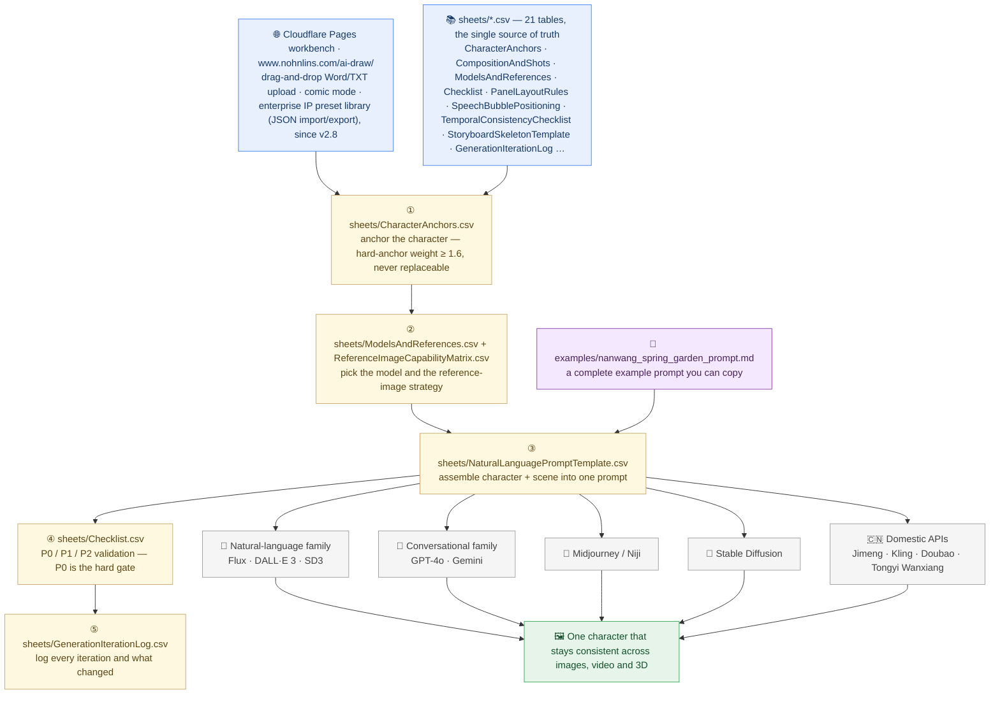

# AI Drawing Cue-Word Project

[简体中文](README-zh.md) | English

> AI Painting Composition Detail Template — Weight & Ratio Precision Control Edition v2.8 (Adaptable Across All Models: setting-layer universal, syntax-layer per-model)

This repository is a version-controlled export of a quality-control workbook for single- and
multi-character AI image, video, and 3D generation. The original is a Tencent Docs spreadsheet;
this repo stores the content as plain CSV (one file per sub-table) plus this README.

## What it is

A practical control desk for building high-consistency character prompts across five prompt syntax families:

- Natural-language flow (Flux / DALL·E 3 / SD3)
- Conversational image models (GPT-4o / Gemini)
- Midjourney / Niji
- Stable Diffusion
- Domestic API models (Jimeng / Kling / Doubao / Tongyi Wanxiang)

v2.8 (vs v2.7) marks the separation of data standard from interactive workbench. The 21 CSV
data sheets remain unchanged. The Cloudflare Pages workbench (www.nohnlins.com/ai-draw/)
upgrades Comic Mode from static table display to full interactive generation: drag-and-drop
Word/TXT upload with mammoth.js .docx parsing, automatic story beat splitting, per-panel
prompt assembly across 4 model families, automatic bubble configuration, and P0 temporal
consistency checklist auto-generation. Enterprise IP Preset Library upgraded with JSON
import/export and localStorage persistence.
v2.7 (vs v2.6) adds: Comic Mode — three new sheets closing the manga/comic generation loop.
PanelLayoutRules covers 5 layout types (4-panel grid, 6-panel grid, cinematic strip, splash page,
vertical scroll/webtoon) with panel arrangement, aspect ratio, composition rule, character placement,
background continuity, prompt assembly rule, visual rhythm control, and common failure per layout.
SpeechBubblePositioning defines 7 bubble types (standard speech, internal monologue, narration,
SFX, whisper, shout, electronic/digital) with tail direction, position rule, size rule, text volume,
shape & style, overlap rule, layer priority, prompt assembly rule, and common failure per bubble type.
TemporalConsistencyChecklist provides 13 verification items across 6 categories (character identity,
spatial continuity, temporal continuity, action continuity, expression continuity, costume & prop)
with severity P0/P1/P2, when to check, what to verify, verification method, pass criteria, fail criteria,
and fix protocol per item. Total sheet count 18→21.
v2.6 (vs v2.5) adds: StoryboardSkeletonTemplate — a manga/comic storyboarding skeleton with
10 panel role templates (establishing, character intro, dialogue A→B, dialogue B→A, action beat,
reaction, emotional close-up, scene transition, climax splash, resolution), 3 camera continuity
rules (180-degree axis, 30-degree rule, eyeline match), and 4 page layout patterns (4-panel grid,
6-panel grid, cinematic strip, splash page). Each row includes prompt assembly rule, continuity
check, and common failure mode. Total sheet count 17→18.
v2.5 (vs v2.4) adds: 5 new sheets covering previously uncovered generation modalities —
video generation (Sora/Kling/Runway/Pika/domestic API with camera movement and temporal structure),
multi-character spatial relations (3+ characters with depth layering, gaze chain, interaction chain),
LoRA management (character/style/outfit/concept/background types with conflict detection and stacking order),
3D generation matrix (Meshy/Tripo3D/Rodin/Hunyuan3D-2/Stable Fast3D/CRM), and
conversational edit chain (round-by-round single-point fix protocol for GPT-4o/Gemini with anchor boundary rules).
Total sheet count 12→17.
v2.4 (vs v2.3) adds: a posture-to-emotion reference table (Section D in Composition & Shots),
mapping character temperament labels to pose/gaze/center-of-gravity combinations. Also
adds a per-character posture-difference field for dual-character scenes.
v2.3 (vs v2.2) adds: a domestic API-family syntax flow, a DALL·E 3 deprecation note,
and an honest Adaptable framing.

## ✦ Architecture (Plain Language)

> **In one sentence:** this repo is a **control desk for AI image prompts** — 21 spreadsheet sheets that turn "hope the face comes out right" into a repeatable checklist.

**How to read it**

1. **Read top to bottom: data in, one character out.** The 21 CSV tables and the online workbench are the two entries; the five-step workflow consumes them and hands one prompt to five model families, and all five should return the same character.
2. **Every box names the real file or table.** `CharacterAnchors.csv`, `ModelsAndReferences.csv`, `NaturalLanguagePromptTemplate.csv`, `Checklist.csv`, `GenerationIterationLog.csv` — open the `sheets/` folder and read along.
3. **The boundary that matters.** The tables *are* the product; step 4 is a hard gate — a P0 failure is a wasted image, so you regenerate instead of hoping.

📖 Every term explained in one plain sentence → [Glossary](./GLOSSARY.md)

## Quick Start

1. **Anchor characters** — fill in character anchors in `sheets/CharacterAnchors.csv` (hard-anchor weight ≥ 1.6, non-replaceable).
2. **Select model and reference strategy** — determine the target model and consistency method in `sheets/ModelsAndReferences.csv` and `ReferenceImageCapabilityMatrix.csv` (MJ `--cref` / SD LoRA / Flux Kontext / conversational reference).
3. **Assemble prompts** — build according to the priority in `sheets/NaturalLanguagePromptTemplate.csv` (hard anchor → core feature → baseline description → atmosphere); for cross-model syntax see "Cross-model syntax red lines".
4. **Validate** — run P0/P1/P2 with `sheets/Checklist.csv`; for multi-character scenes add `MultiCharacterSpatialRelations.csv`, for comics add `PanelLayoutRules.csv` / `SpeechBubblePositioning.csv` / `TemporalConsistencyChecklist.csv`.
5. **Log iterations** — record every generation in `sheets/GenerationIterationLog.csv`; after 3 consecutive failures of the same type, switch model or parameter route.

A full walkthrough example is in [`examples/nanwang_spring_garden_prompt.md`](examples/nanwang_spring_garden_prompt.md) (finished prompts for the same character setting across 4 syntax flows).

## Sub-tables (in `/sheets`)

> File names have been unified to English for GitHub rendering; Chinese original names are shown in parentheses. All 21 sheets map one-to-one with the earlier Chinese export.

| File | Description |
|---|---|
| `Usage.csv` (使用说明) | Workflow, weight semantics, weight→narrative mapping, P0/P1/P2 validation, cross-model red lines |
| `CharacterAnchors.csv` (角色锚点) | Per-character anchor points; anchor weight ≥ 1.6, never replaceable |
| `CompositionAndShots.csv` (构图与镜头) | Composition types, lens, light, layering, pose templates; multi-character spatial fields |
| `FeatureDetails.csv` (特征细节) | Feature-level descriptors |
| `NaturalLanguagePromptTemplate.csv` (自然语言叙述模板) | Assembled prompt templates per syntax family |
| `ModelsAndReferences.csv` (模型与参考) | Model reference-image means & consistency strategy |
| `NegativeWordBank.csv` (负面词库) | Negative prompts per model (MJ `--no` 4-6 words; SD Negative box; affirmative writing for no-negative models) |
| `Checklist.csv` (校验清单) | P0 hard / P1 suggested / P2 optional validation |
| `AspectRatioBaselines.csv` (比例基准表) | Head-body ratio per art style (Q-version 2-3, loli 4-5, girl 6-6.5, youth 6.5-7, adult 7-8, realistic 7.5+); tolerance ≤5% |
| `ReferenceImageCapabilityMatrix.csv` (参考图能力矩阵) | Per-model reference-image capability (MJ `--cref`, SD LoRA, Flux Kontext/Redux, GPT-4o/Gemini native, DALL·E 3 none) |
| `GenerationIterationLog.csv` (生成迭代日志) | Per-generation iteration records |
| `VideoGenerationPromptTemplate.csv` (视频生成模板) | Per-model video prompt syntax (Sora/Kling/Runway/Pika/domestic API) with camera movement, temporal structure, and cross-frame anchor consistency |
| `MultiCharacterSpatialRelations.csv` (多角色空间关系) | 3+ character spatial arrangement, depth layering, gaze chain, interaction chain, occlusion rules, scale perspective |
| `LoRAManagement.csv` (LoRA管理) | LoRA type classification (character/style/outfit/concept/background), weight ranges, conflict detection, stacking order, cross-model applicability |
| `ThreeDGenerationMatrix.csv` (3D生成矩阵) | Per-model 3D generation capability (Meshy/Tripo3D/Rodin/Hunyuan3D-2/Stable Fast3D/CRM) — input format, output format, texture, topology, identity consistency |
| `ConversationalEditChain.csv` (对话式编辑链) | Round-by-round single-point fix protocol for GPT-4o/Gemini; anchor boundary rules; failure handling per round |
| `PanelLayoutRules.csv` (面板排布规则) | 5 comic layout types (4-panel / 6-panel / cinematic strip / splash page / vertical scroll) — panel arrangement, aspect ratio, composition rule, character placement, background continuity, prompt assembly, visual rhythm control, common failure |
| `SpeechBubblePositioning.csv` (对话气泡定位) | 7 bubble types (standard speech / internal monologue / narration / SFX / whisper / shout / electronic) — tail direction, position rule, size rule, text volume, shape & style, overlap rule, layer priority, prompt assembly, common failure |
| `TemporalConsistencyChecklist.csv` (时序一致性验收) | 13 verification items across 6 categories (character identity / spatial / temporal / action / expression / costume-prop) — severity P0/P1/P2, check timing, verification method, pass criteria, fail criteria, fix protocol |
| `StoryboardSkeletonTemplate.csv` (分镜骨架模板) | Manga/comic storyboarding skeleton — 10 panel roles, 3 camera continuity rules, 4 page layout patterns; each row has prompt assembly rule, continuity check, common failure |
| `ChangeLog.csv` (修改日志) | Template revision history |

## Weight semantics (SD / MJ numeric system)

| Range | Meaning | Example |
|---|---|---|
| 1.6 – 2.0 | Hard anchor: absolutely immutable | left under-eye mole (1.8) |
| 1.3 – 1.5 | Core feature: retained across all scenes | light-cyan cotton dress (1.4) |
| 1.0 – 1.2 | Baseline: default strength | gentle quiet temperament (1.0) |
| 0.7 – 0.9 | Ambient aid: adjustable per scene | spring garden (0.8) |
| < 0.7 | Weak hint: easily ignored | breeze (0.5) |

Natural-language models have no numeric weights; map the numeric value to narrative
position/precision (see Instructions sheet).

## Cross-model syntax red lines

- Weight syntax `(word:1.3)` works only in SD; MJ relies on token position & repetition
  (`::` multi-prompt weighting ended at v6.1);
  natural-language models forbid bracket weights.
- Negative prompts: MJ `--no` 4-6 short words; SD Negative Prompt box (weight the negatives too);
  FLUX.2 and Gemini 3 Pro Image have **no negative prompting at all** → write affirmatively only;
  domestic API models: negative-prompt support varies, check official docs.
- Reference images: MJ `--cref` is **v6-only** (v7 uses `--oref`/`--ow`, v8 uses the Edit Model);
  SD LoRA/IP-Adapter; FLUX.2 multi-reference + Edit; Gemini 3 Pro Image native (up to 14 refs);
  DALL·E 3 none (deprecated for multi-image series) → description-led;
  domestic API models: capability per official docs (see matrix).
- MJ version: **Niji 7 has no V8 counterpart** — write `--niji 7` explicitly or the V8.2 default
  silently renders the anime request instead.
- Anchor reuse: natural-language models must reuse anchor sentences verbatim across images;
  no synonym substitution (e.g. "tear mole" must not become "spot" or "small mole").

## Validation priority

- **P0** — core character settings; failure = wasted image; must regenerate.
- **P1** — image quality & ratio; affects usability; fix first, one retry allowed.
- **P2** — aesthetics & detail; record and improve next round.

## Source

Original Tencent Docs: https://docs.qq.com/sheet/DT05rb0tCVmVSSVpR

## License

Licensed under the Apache License 2.0. See [LICENSE](LICENSE).
Copyright (c) 2026 NOHN AI TECHNOLOGY PTE LTD. Contact: ai@nohnlins.com.
